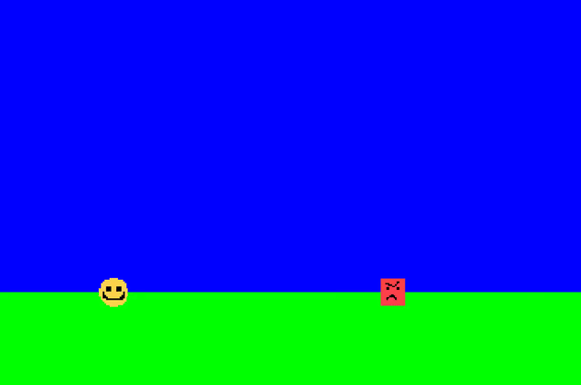

# Supercell Coding Competition

This was Supercell coding test. There was given basic game built with SFML library and it had bugs. Theme of the game is "Endless Runner".

Idea of the project was to fix the bugs and add own features to the game to make it more playable and fun.

Timelimit for this challenge is 24 hours of planning features without the codebase and then 12 hours to code the features.

<div style="display: flex; gap: 20px;">
  <div>
    <h3>Original game</h3>
    
  </div>
  <div>
    <h3>My improved game</h3>
    
  </div>
</div>

## My contribution

- Add flying physics with repelling force from ground
- Fuel usage accelerates player upwards
- Add appearance of ground and roof
- Ramping up difficulty by
    - enemy size growth over time
    - speedup of game over time
- Change color theme to space

## How to play

Download repository
``` Bash
git clone https://github.com/vallucodes/Endless-runner.git
cd Endless-runner
```

Compile the project

``` Bash
cmake -B build
cmake --build build
./build/bin/survive
```
This builds the executable in `./build/bin/`.

The exact location of the executable may differ depending on your system and compiler. Example locations are `./build/bin/runner` and `./build/bin/Debug/runner.exe`.

## Controls and game instructions

- `Space` to fly up
- You die when your spacecraft collides with enemies, ground or roof
- Fuel is quickly exhausted and quickly regenerated

## Prerequisites

You must have [CMake](https://cmake.org/) version 3.22.1 or later installed to build this project.

If you are on Linux, make sure to install SFML's dependencies. For Debian-based distros:
```
sudo apt update
sudo apt install \
    libxrandr-dev \
    libxcursor-dev \
    libudev-dev \
    libfreetype-dev \
    libopenal-dev \
    libflac-dev \
    libvorbis-dev \
    libgl1-mesa-dev \
    libegl1-mesa-dev
```
    - steepening ground elevation variation over time
